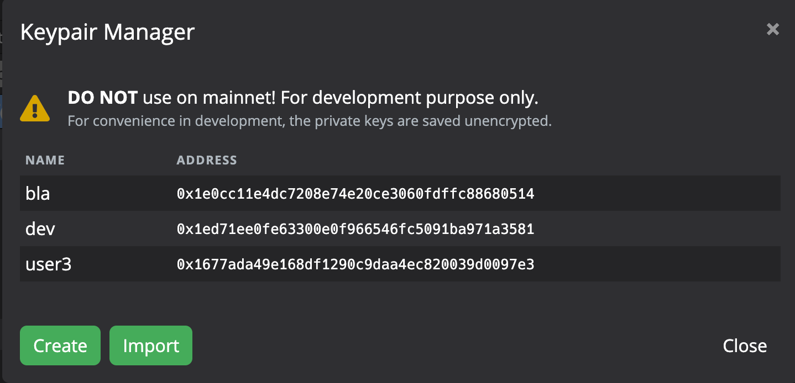

- [使用环境说明](#使用环境说明)
- [BUG](#bug)
  - [编译错误](#编译错误)
  - [使用Conflux node version为1.1.1-testnet时新建实例失败](#使用conflux-node-version为111-testnet时新建实例失败)
  - [Conflux 使用 Open Zeppelin库 相关问题](#conflux-使用-open-zeppelin库-相关问题)
- [使用体验反馈](#使用体验反馈)
  - [密钥对管理器](#密钥对管理器)
  - [Transactions](#transactions)
  - [ABI Storage](#abi-storage)
  - [导航栏](#导航栏)
  - [项目资源管理器](#项目资源管理器)
  - [solidity 编辑器](#solidity-编辑器)
  - [终端](#终端)
## 使用环境说明
如无特殊说明，以下问题发生的环境如下：  
设备： MacBook Pro 13-inch 2017  
CPU： 2.3GHz Intel Core i5  
内存 8GB 2133 MHz LPDDR3  
系统： macOS Mojave  


## BUG
### 编译错误
部分项目在编译时会报错，可能原因是默认使用的truffle docker相关设置不合适。
复现方式如下
1. 新建项目时选择Open Zeppelin模版项目
    
2. 在新项目中直接编译会报错，报错信息如下
``` shell
> docker run -t --rm --name truffle-compile -v /var/run/docker.sock:/var/run/docker.sock -v "/Users/username/Conflux Studio/oz-project:/Users/username/Conflux Studio/oz-project" -w "/Users/username/Conflux Studio/oz-project" obsidians/conflux-truffle:0.0.8 cfxtruffle compile --compilers.solc.version '0.6.12' --compilers.solc.docker 1
> Warning: possible unsupported (undocumented in help) command line option: --compilers.solc.version,--compilers.solc.docker

Compiling your contracts...
===========================
> Compiling ./contracts/GLDToken.sol
> Compiling ./contracts/GameItem.sol
> Compiling ./contracts/GameItems.sol
> Compiling @openzeppelin/contracts/introspection/ERC165.sol
> Compiling @openzeppelin/contracts/introspection/IERC165.sol
> Compiling @openzeppelin/contracts/math/SafeMath.sol
> Compiling @openzeppelin/contracts/token/ERC1155/ERC1155.sol
> Compiling @openzeppelin/contracts/token/ERC1155/IERC1155.sol
> Compiling @openzeppelin/contracts/token/ERC1155/IERC1155MetadataURI.sol
> Compiling @openzeppelin/contracts/token/ERC1155/IERC1155Receiver.sol
> Compiling @openzeppelin/contracts/token/ERC20/ERC20.sol
> Compiling @openzeppelin/contracts/token/ERC20/IERC20.sol
> Compiling @openzeppelin/contracts/token/ERC721/ERC721.sol
> Compiling @openzeppelin/contracts/token/ERC721/IERC721.sol
> Compiling @openzeppelin/contracts/token/ERC721/IERC721Enumerable.sol
> Compiling @openzeppelin/contracts/token/ERC721/IERC721Metadata.sol
> Compiling @openzeppelin/contracts/token/ERC721/IERC721Receiver.sol
> Compiling @openzeppelin/contracts/utils/Address.sol
> Compiling @openzeppelin/contracts/utils/Context.sol
> Compiling @openzeppelin/contracts/utils/Counters.sol
> Compiling @openzeppelin/contracts/utils/EnumerableMap.sol
> Compiling @openzeppelin/contracts/utils/EnumerableSet.sol
> Compiling @openzeppelin/contracts/utils/Strings.sol
Error: spawnSync /bin/sh ENOBUFS
    at Object.spawnSync (internal/child_process.js:1041:20)
    at spawnSync (child_process.js:616:24)
    at execSync (child_process.js:661:15)
    at Object.compile (/usr/local/lib/node_modules/conflux-truffle/build/webpack:/packages/compile-solidity/compilerSupplier/loadingStrategies/Docker.js:19:1)
    at invokeCompiler (/usr/local/lib/node_modules/conflux-truffle/build/webpack:/packages/compile-solidity/run.js:257:1)
    at run (/usr/local/lib/node_modules/conflux-truffle/build/webpack:/packages/compile-solidity/run.js:29:40)
    at compile (/usr/local/lib/node_modules/conflux-truffle/build/webpack:/packages/compile-solidity/new/index.js:23:1)
    at AsyncFunction.compile.with_dependencies (/usr/local/lib/node_modules/conflux-truffle/build/webpack:/packages/compile-solidity/new/index.js:106:1)
    at compile.necessary (/usr/local/lib/node_modules/conflux-truffle/build/webpack:/packages/compile-solidity/new/index.js:62:1)
    at /usr/local/lib/node_modules/conflux-truffle/build/webpack:/packages/workflow-compile/new/index.js:50:1
    at async Promise.all (index 0)
    at compile (/usr/local/lib/node_modules/conflux-truffle/build/webpack:/packages/workflow-compile/new/index.js:37:1)
    at Object.compile (/usr/local/lib/node_modules/conflux-truffle/build/webpack:/packages/workflow-compile/new/index.js:80:52)
Conflux-Truffle v0.0.8 (core: 5.1.29)
Node v12.18.4
```
### 使用Conflux node version为1.1.1-testnet时新建实例失败
新建节点实例时选择Conflux node version 为 `1.1.1-testnet` 后，创建实例时会失败
``` shell
> docker run -it --rm --name conflux-test-node-1.1.1-testnet -p 12535:12535 -p 12536:12536 -p 12537:12537 -v conflux-test-node:/conflux-node -w /conflux-node --entrypoint conflux confluxchain/conflux-rust:1.1.1-testnet --config default.toml
docker: Error response from daemon: OCI runtime create failed: container_linux.go:370: starting container process caused: exec: "conflux": executable file not found in $PATH: unknown.
```

### Conflux 使用 Open Zeppelin库 相关问题
参考[community-faq](https://github.com/conflux-fans/conflux-faqs/blob/main/community-faq.md#conflux%E6%94%AF%E6%8C%81openzepplin%E8%BF%99%E4%B8%AA%E4%BB%A5%E5%A4%AA%E5%9D%8A%E5%BA%93%E5%90%97)中说明： Conflux链上erc1820合约地址与eth链不同，conflux上1820合约地址为：0x88887eD889e776bCBe2f0f9932EcFaBcDfCd1820。 Conflux Studio 新建 Open Zeppelin 模版项目时使用的库中相关地址并未给出更改，直接将对应合约部署到Conflux网络会报错。
可供参考的解决方法：
1.  在使用 Open Zeppelin 模版时给出相关提示，并且在部署相应合约出错时对用户进行提示。
2.  或者对Open Zeppelin库中相关变量进行修改， 使用 Open Zeppelin 模版新建项目时使用已修改ERC1820地址对 Open Zeppelin 库。


## 使用体验反馈
### 密钥对管理器
1. 显示私钥提示词建议更改为“Click again to reveal private key”
    
2. 密钥对管理器中最好提供格式转换的功能。例如，可以在下图中右上角增加下拉框，让使用者选择地址显示格式。
    
3. 可以在密钥对管理器中也显示各个地址的余额，同时点击后可以链接至 Conflux studio 的 Explorer 部分。

### Transactions
Transactions 列表失焦后会自动收起。希望能添加“固定”的功能，让该界面不会自动收起，悬浮在界面中或者是固定在页面中（类似终端）。

### ABI Storage
手动导入 ABI 时只能手动输入内容导入，希望增加从 `JSON` 文件导入的功能。

### 导航栏
目前的导航栏在选择对应选项时会将对应选项亮起。但就视觉表现来说可能仍然不够直观。希望能够有更符合直觉的方案（优先级较低）


### 项目资源管理器

1. 右键点击空白处时无反馈，在空白处右键应该有如“新建文件”/“新建文件夹”等选项
2. 不支持拖动操作，例如：无法通过拖动`README.md`的方式将该文件移入`contracts`文件夹。
3. 重命名操作后，主编辑区的相应文件名没有进行相应更改，例如下图将`README.md`更改为`READMEEEE.md`后，右侧主编辑区的文件名仍然为`README.md`。
    
4. 在 3 的操作后，此时更改右侧文件`README.md`内容并保存后，会在编辑区生成新建的文件`README.md`。

5. 类似3。在删除文件后，右侧主编辑区的该文件不会删除。
6. `./node_modules`文件夹被设为默认隐藏，应允许用户查看被隐藏的该文件夹。

### solidity 编辑器
1. 变量未高亮。如下图中 player 变量未高亮
   
2. 部分快捷键缺失，如注释。
3. 输入如` ( { [ `等符号时不会自动生成对应等` ) } ] `等符号。
4. 使用Open Zeppelin库时，缺少相应的自动补全（如 `balanceOf()` 等函数）

### 终端
1. 无法通过“上箭头”输入上一条运行的命令。
2. 命令执行时，无法在命令行用（ctrl+c）将其停止。
3. 无法开多个终端
