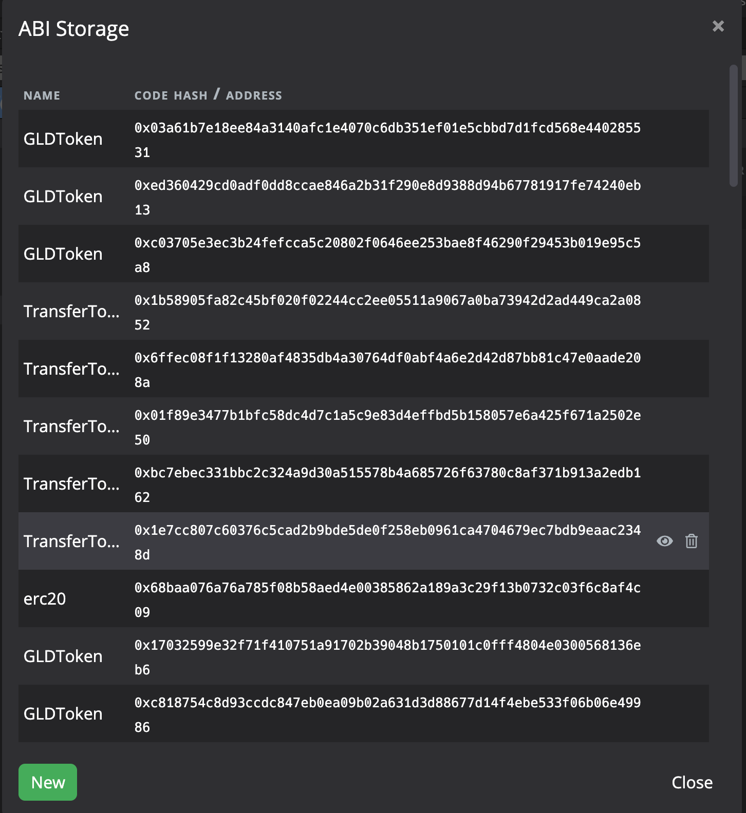
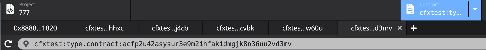
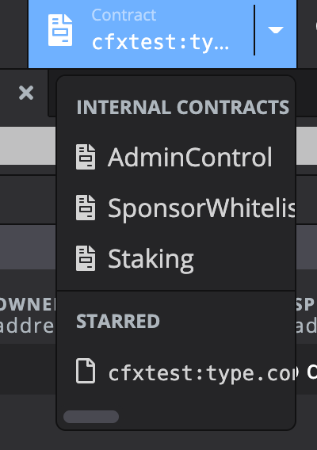
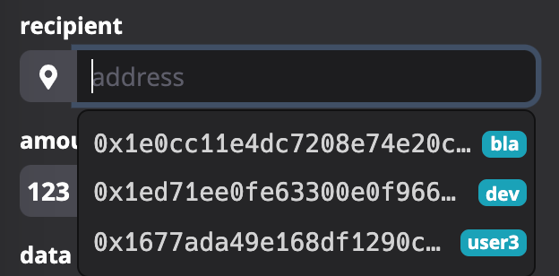
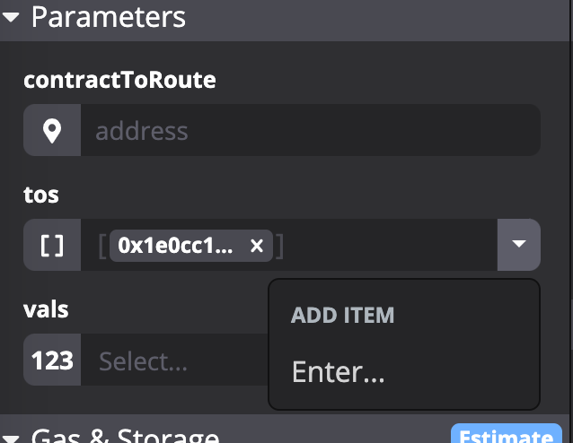
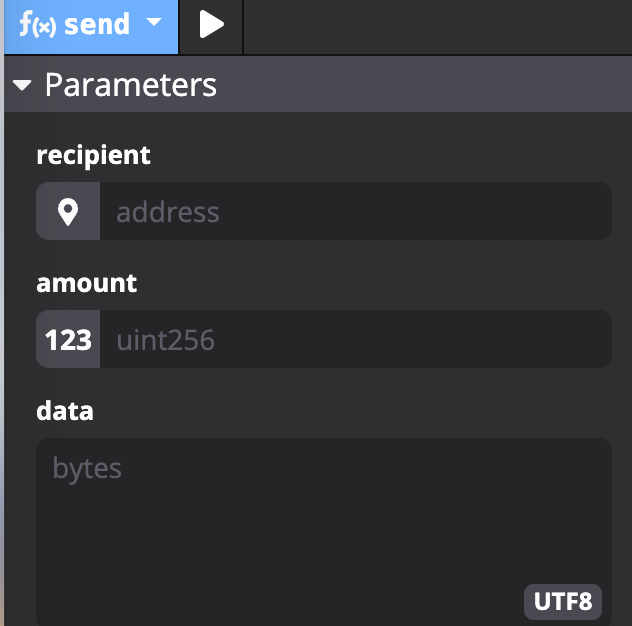

## 使用环境说明
如无特殊说明，以下问题发生的环境如下：  
设备： MacBook Pro 13-inch 2017  
CPU： 2.3GHz Intel Core i5  
内存 8GB 2133 MHz LPDDR3  
系统： macOS Mojave

## Bugs
### Gas估算
智能合约部分函数在estimate后可能会由于Gas不足无法运行。请检查在调用`estimateGasAndCollateral`之后确认使用的是`GasLimit`还是`GasUsed`（应为`GasLimit`）。  
另外在燃气费不足时不会提供详细的报错原因说明，这部分需要加上。

## 使用体验反馈
### 合约ABI修改
目前没有可以修改合约ABI的办法，希望能加上

### 显示合约名称
在合约标签栏上显示的是合约的地址，比较难于分辨，对于使用Conflux Studio部署的合约，最好自动加上合约的名称，并允许用户编辑。

Star部分同理。

### Key Manager/填地址时允许填入Contract地址
在填入地址时目前会默认提供Key Manager中的地址供选择。应该也允许填入Contract的地址（可以考虑将star的contract也作为默认选项提供）。

### 添加数组成员时操作与显示优化
1.  添加地址数组的成员后，显示的为地址的值而非Name。
2.  添加数组成员时需要点击 下拉按钮->Enter 才能添加。可以将下拉按钮替换成 “+” 按钮

### 填入Byte类型数据时允许UTF-8以外格式
目前只能以UTF-8格式填入byte类型的数据。应提供切换功能（如16进制字符串、uint8数组等）

### Conflux Studio 提供自动更新选项
目前Conflux Studio只能手动更新，最好提供自动更新选项
