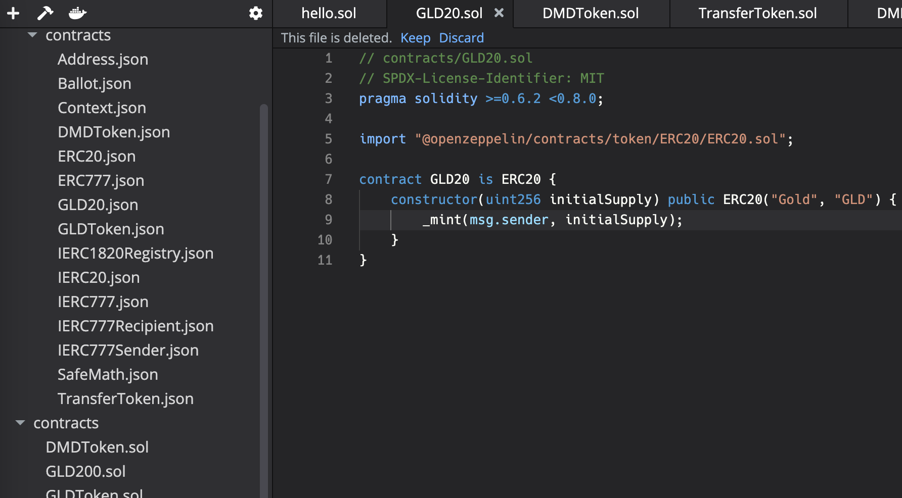

# Conflux Studio 8.0-rc1 Feedback

## 更新反馈

### 格式化文件

格式化文件没有生效，例如使用ERC20的示例代码

``` solidity
// contracts/GLD20.sol
// SPDX-License-Identifier: MIT
pragma solidity >=0.6.2 <0.8.0;

import "@openzeppelin/contracts/token/ERC20/ERC20.sol";

contract GLD20 is ERC20 {
    constructor(uint256 initialSupply) public ERC20("Gold", "GLD") {
        // 下面这行被加入了空格
        _mint(msg.sender,      initialSupply);
    }
}
```

右键或通过快捷键使用formatter都没有生效。

### 重命名与文件删除

在资源管理器中重命名某文件A后，仍在主工作区的文件A会被提示删除。例如将`GLD20.sol`重命名为`GLD200.sol`。


## tab 切换

在终端中点击tab时光标会移动到左下角到`Transactions`。光标应该停留在终端内。

## 其他反馈

### Markdown 文件链接跳转问题

例如
```md
English | [简体中文](./README-CN.md)
```
在点击 `简体中文` 链接时，会跳转到其他项目（应为其他markdown文件）


