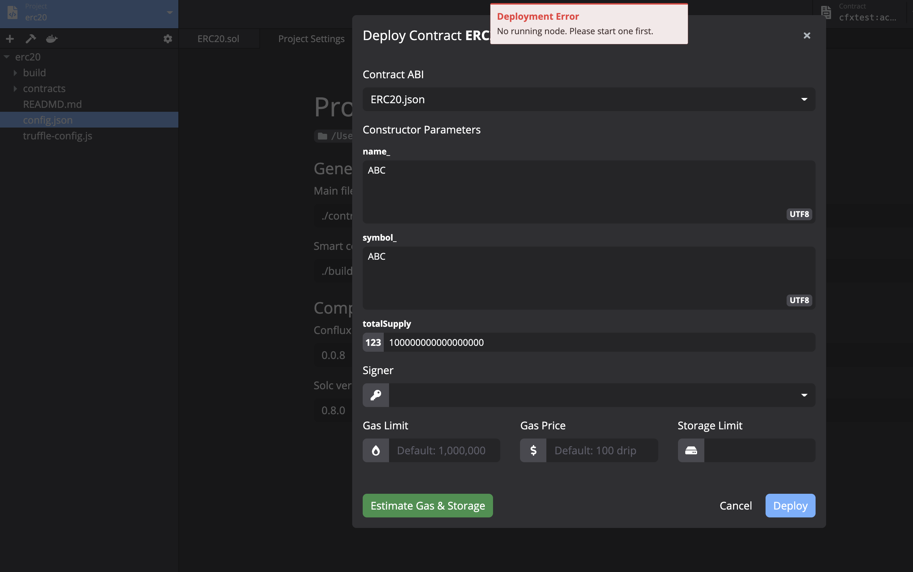
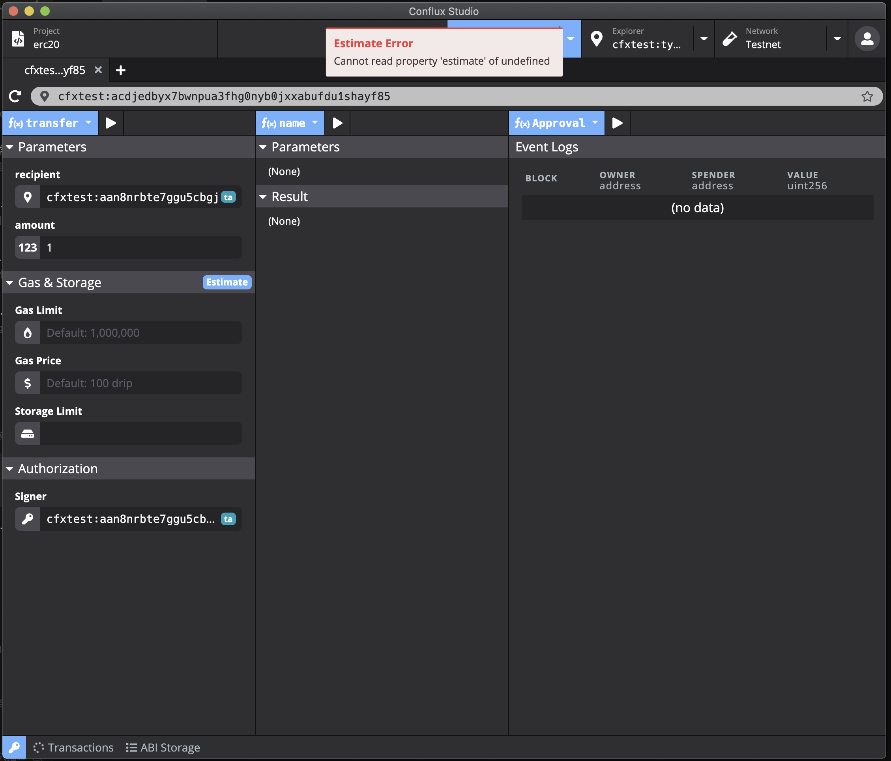
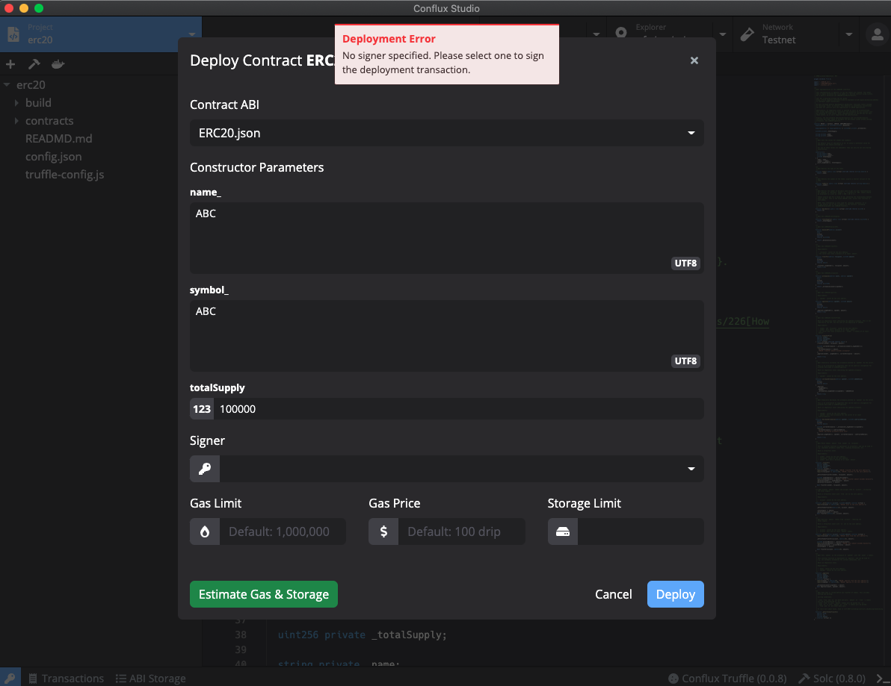

<!-- START doctoc generated TOC please keep comment here to allow auto update -->
<!-- DON'T EDIT THIS SECTION, INSTEAD RE-RUN doctoc TO UPDATE -->
<!-- **Table of Contents**  *generated with [DocToc](https://github.com/thlorenz/doctoc)* -->

- [Conflux studio 0.8.3-rc3 feedback](#conflux-studio-083-rc3-feedback)
  - [一、合约调用相关bug](#%E4%B8%80%E5%90%88%E7%BA%A6%E8%B0%83%E7%94%A8%E7%9B%B8%E5%85%B3bug)
    - [1. 合约函数地址类型参数不显示key manager列表](#1-%E5%90%88%E7%BA%A6%E5%87%BD%E6%95%B0%E5%9C%B0%E5%9D%80%E7%B1%BB%E5%9E%8B%E5%8F%82%E6%95%B0%E4%B8%8D%E6%98%BE%E7%A4%BAkey-manager%E5%88%97%E8%A1%A8)
    - [2. 传参正确，estimate报错](#2-%E4%BC%A0%E5%8F%82%E6%AD%A3%E7%A1%AEestimate%E6%8A%A5%E9%94%99)
    - [3. 不弹signer列表](#3-%E4%B8%8D%E5%BC%B9signer%E5%88%97%E8%A1%A8)
    - [4. 部署合约时estimate报错 `network if offline`](#4-%E9%83%A8%E7%BD%B2%E5%90%88%E7%BA%A6%E6%97%B6estimate%E6%8A%A5%E9%94%99-network-if-offline)
    - [5. 部署合约时estimate报错 `No running node`](#5-%E9%83%A8%E7%BD%B2%E5%90%88%E7%BA%A6%E6%97%B6estimate%E6%8A%A5%E9%94%99-no-running-node)
    - [6. estimate合约函数报错 `cannot read estimate property of undefined`](#6-estimate%E5%90%88%E7%BA%A6%E5%87%BD%E6%95%B0%E6%8A%A5%E9%94%99-cannot-read-estimate-property-of-undefined)
  - [二、体验优化](#%E4%BA%8C%E4%BD%93%E9%AA%8C%E4%BC%98%E5%8C%96)
    - [1. Keypair Manager](#1-keypair-manager)
      - [1.1 相关反馈](#11-%E7%9B%B8%E5%85%B3%E5%8F%8D%E9%A6%88)
        - [1.1.1 部署合约报 `No signer specified`，但没有说明原因没有指引应该怎么做](#111-%E9%83%A8%E7%BD%B2%E5%90%88%E7%BA%A6%E6%8A%A5-no-signer-specified%E4%BD%86%E6%B2%A1%E6%9C%89%E8%AF%B4%E6%98%8E%E5%8E%9F%E5%9B%A0%E6%B2%A1%E6%9C%89%E6%8C%87%E5%BC%95%E5%BA%94%E8%AF%A5%E6%80%8E%E4%B9%88%E5%81%9A)

<!-- END doctoc generated TOC please keep comment here to allow auto update -->

# Conflux studio 0.8.3-rc3 feedback
## 一、合约调用相关bug
### 1. 合约函数地址类型参数不显示key manager列表
点击不显示key manager列表
### 2. 传参正确，estimate报错
调用合约函数输入没有问题的情况下，estimate报错"Estimate Error: path="", h(,1), path="", (), not match "hex""
### 3. 不弹signer列表
signer 没有弹出 signer列表，也没有默认上设置signer

### 4. 部署合约时estimate报错 `network if offline`
复现步骤：
1. network选择development
2. 启动 conflux-rust-docker 1.1.1-pre版本实例
3. 创建ERC20模板的project
4. 编译
5. 点击部署->填入构造参数->Estimate报如图所示错误

### 5. 部署合约时estimate报错 `No running node`
复现步骤：
1. 按照"部署合约报错 network if offline"步骤运行
2. 切换network为testnet
3. 点击部署->填入构造参数->Estimate报如图所示错误

### 6. estimate合约函数报错 `cannot read estimate property of undefined`
复现步骤：
1. 创建erc20模板, 使用testnet网络
2. 部署
3. 对 `transfer` 函数 `estimate` （但直接运行不报错）

## 二、体验优化

### 1. Keypair Manager
私钥有使用范围限制，范围需要标识，否则会产生如下["No signer specified"]((#%E7%9B%B8%E5%85%B3%E5%8F%8D%E9%A6%88))的困惑
1. 在创建私钥或导入时提供用户选择使用范围的选项
2. 在地址后增加使用范围复选框 "dev, testnet, mainnet"，在勾选mainnet时提示危险性并需用户2次确认
3. 用户可随时修改使用范围
4. 在当前网络没有可使用的私钥时，提示用户”该网络没有可用私钥，请创建或导入私钥“

#### 1.1 相关反馈
##### 1.1.1 部署合约报 `No signer specified`，但没有说明原因没有指引应该怎么做
复现步骤：
1. 在"部署合约报错 No running node"导致无法部署后，重启conflux-studio，并重复该步骤
2. 报错 `No signer specified`

