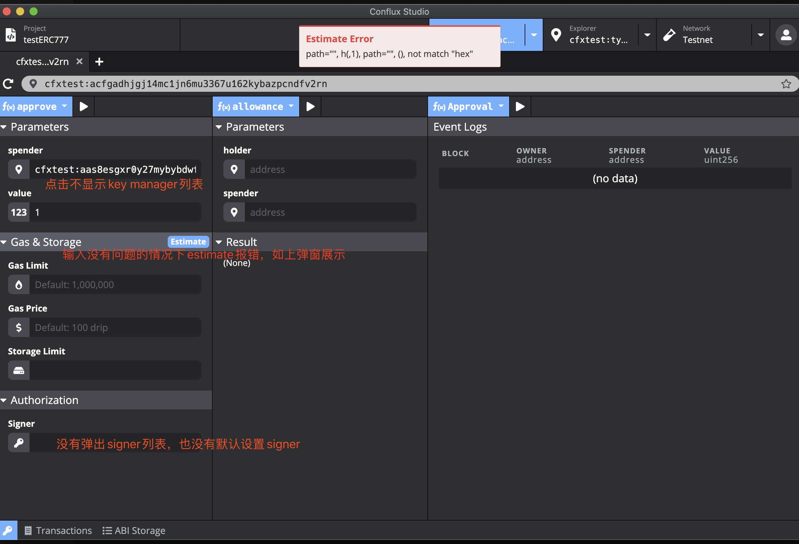

<!-- START doctoc generated TOC please keep comment here to allow auto update -->
<!-- DON'T EDIT THIS SECTION, INSTEAD RE-RUN doctoc TO UPDATE -->
**Table of Contents**  *generated with [DocToc](https://github.com/thlorenz/doctoc)*

- [Conflux studio 0.8.3-rc3 feedback](#conflux-studio-083-rc3-feedback)
  - [合约调用相关bug](#%E5%90%88%E7%BA%A6%E8%B0%83%E7%94%A8%E7%9B%B8%E5%85%B3bug)
    - [合约函数地址类型参数不显示key manager列表](#%E5%90%88%E7%BA%A6%E5%87%BD%E6%95%B0%E5%9C%B0%E5%9D%80%E7%B1%BB%E5%9E%8B%E5%8F%82%E6%95%B0%E4%B8%8D%E6%98%BE%E7%A4%BAkey-manager%E5%88%97%E8%A1%A8)
    - [传参正确，estimate报错](#%E4%BC%A0%E5%8F%82%E6%AD%A3%E7%A1%AEestimate%E6%8A%A5%E9%94%99)
    - [不弹signer列表](#%E4%B8%8D%E5%BC%B9signer%E5%88%97%E8%A1%A8)

<!-- END doctoc generated TOC please keep comment here to allow auto update -->

# Conflux studio 0.8.3-rc3 feedback
## 合约调用相关bug
### 合约函数地址类型参数不显示key manager列表
点击不显示key manager列表
### 传参正确，estimate报错
调用合约函数输入没有问题的情况下，estimate报错"Estimate Error: path="", h(,1), path="", (), not match "hex""
### 不弹signer列表
signer 没有弹出 signer列表，也没有默认上设置signer

